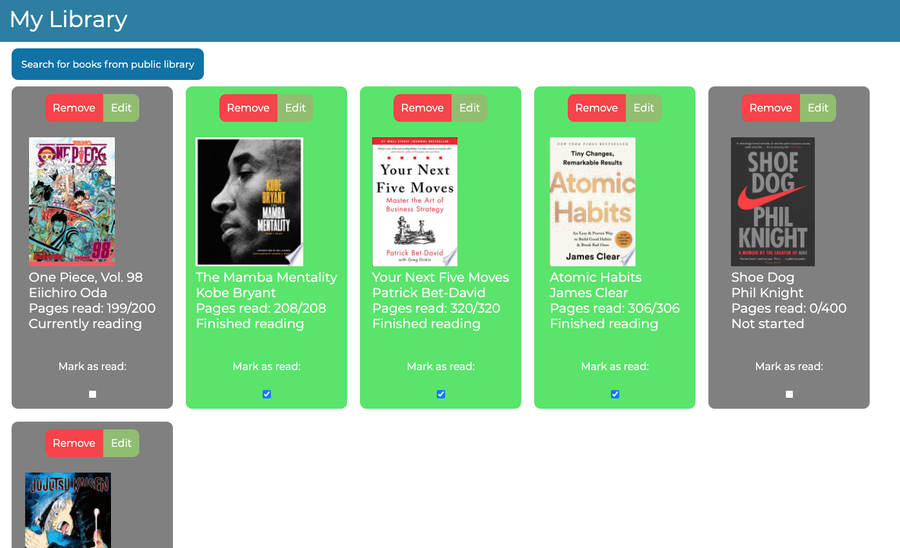
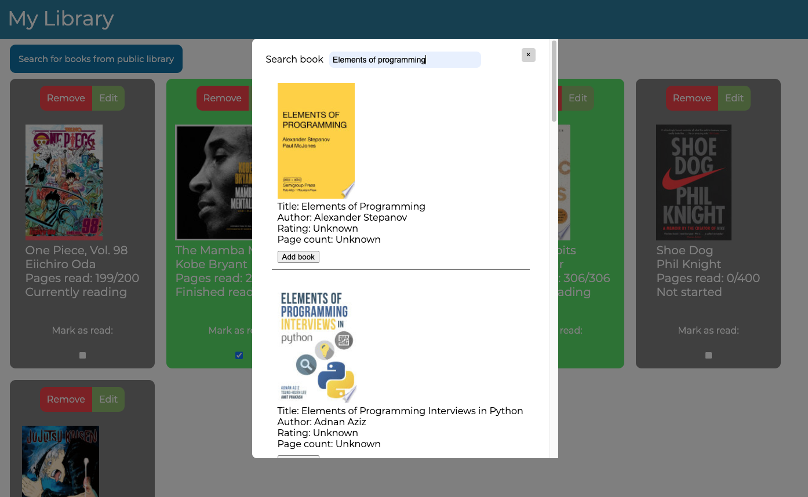

<!--

<!-- PROJECT LOGO -->
<br />
<p align="center">
  <a href="https://github.com/Curlos/Library">
    
  </a>

  <h3 align="center">Local Library</h3>

  <p align="center">
    <a href="https://library-opal.vercel.app/">View Demo</a>
    ·
    <a href="https://github.com/Curlos/Library/issues">Report Bug</a>
    ·
    <a href="https://github.com/Curlos/Library/issues">Request Feature</a>
  </p>
</p>


<!-- TABLE OF CONTENTS -->
<details open="open">
  <summary>Table of Contents</summary>
  <ol>
    <li>
      <a href="#about-the-project">About The Project</a>
      <ul>
        <li><a href="#built-with">Built With</a></li>
      </ul>
    </li>
    <li>
      <ul>
        <li><a href="#installation">Installation</a></li>
      </ul>
    </li>
    <li><a href="#usage">Usage</a></li>
    <li><a href="#license">License</a></li>
    <li><a href="#acknowledgements">Acknowledgements</a></li>
  </ol>
</details>


<!-- ABOUT THE PROJECT -->
## About The Project

Local Library
Add the books you plan on reading, are reading and have read through a form or by searching for it through the Google Books API where the books you add will be stored in the local cache. Books can be added, edited and removed.

### Built With

* HTML
* CSS
* JavaScript

### Installation

1. Clone the repo
   ```sh
   git clone https://github.com/Curlos/Library
   ```
2. Right click index.html and open with your browser (Google Chrome, Firefox, etc.)


<!-- USAGE EXAMPLES -->
## Usage




<!-- LICENSE -->
## License

Distributed under the MIT License. See `LICENSE` for more information.


<!-- ACKNOWLEDGEMENTS -->
## Acknowledgements
* <div>Icons made by <a href="https://www.freepik.com" title="Freepik">Freepik</a> from <a href="https://www.flaticon.com/" title="Flaticon">www.flaticon.com</a></div>
